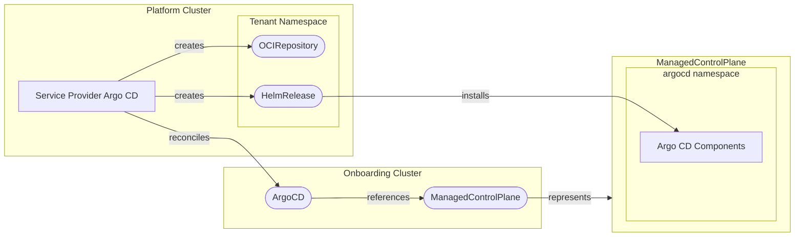

[](https://api.reuse.software/info/github.com/openmcp-project/service-provider-argocd)

# service-provider-argocd

A service provider for managing [Argo CD](https://argo-cd.readthedocs.io/) deployments within a ManagedControlPlane environment. This provider enables GitOps capabilities by automatically installing and configuring Argo CD on managed control planes.

## Architecture Overview

Service Provider Argo CD runs on the platform cluster of an [Open Control Plane installation](https://openmcp-project.github.io/docs/operators/overview). It reconciles `ArgoCD` resources and installs [Argo CD](https://argo-cd.readthedocs.io/) onto the ManagedControlPlane of the requesting tenant using Flux (`OCIRepository` + `HelmRelease`).



## API Reference

### ArgoCD

The `ArgoCD` resource represents an Argo CD installation for a `ManagedControlPlane`.

```yaml
apiVersion: argocd.services.open-control-plane.io/v1alpha1
kind: ArgoCD
metadata:
  name: my-argocd
spec:
  version: "v3.1.0"
  # Optional: namespace on the ManagedControlPlane to install Argo CD into.
  namespaceOverride: argocd
  # Optional: expose the Argo CD server externally via a TLS-terminated
  # LoadBalancer (see "Exposure" below). Omit to keep Argo CD in-cluster only.
  exposure:
    host: argocd
    # Optional: restrict LoadBalancer access to these CIDR ranges.
    allowedIPs:
      - 203.0.113.0/24
```

| Field                    | Type   | Description                                                                           |
| ------------------------ | ------ | ------------------------------------------------------------------------------------- |
| `spec.version`           | string | The Argo CD version to install. Must match a version defined in the `ProviderConfig`. |
| `spec.namespaceOverride` | string | Target namespace on the ManagedControlPlane. Defaults to the provider's namespace.    |
| `spec.exposure`          | object | Optional external exposure of the Argo CD server. Its presence enables exposure.      |
| `spec.exposure.host`     | string | Sub-domain label (e.g. `argocd`) or a fully-qualified domain name. A bare label is completed with the shoot's root domain, derived from the MCP apiserver host. |
| `spec.exposure.allowedIPs` | array | Optional CIDR ranges allowed to reach the LoadBalancer. Empty means all sources. Invalid CIDRs are rejected. |
| `status.endpoint`        | string | The externally reachable URL, published only once exposure is provisioned and ready.  |


### ProviderConfig

The `ProviderConfig` resource configures the versions of Argo CD that the service provider supports and their deployment artifacts.

```yaml
apiVersion: argocd.services.open-control-plane.io/v1alpha1
kind: ProviderConfig
metadata:
  name: argocd
spec:
  # Optional: reconcile interval to prevent drift of managed resources.
  pollInterval: 1m
  # Optional: landscape-wide policy applied when a tenant requests exposure.
  exposure:
    dnsClass: garden
    dnsTTL: 3600
    certPurpose: managed
  # Optional: install the Stakater Reloader addon alongside Argo CD so
  # argocd-server restarts when its managed TLS certificate rotates.
  reloader:
    chartVersion: "2.2.12"
    # Optional: OCI registry URL of the Reloader Helm chart.
    chartUrl: "oci://ghcr.io/stakater/charts/reloader"
  versions:
    - version: "v3.1.0"
      chartVersion: "8.1.0"
      # Optional: OCI registry URL of the Argo CD Helm chart.
      chartUrl: "oci://ghcr.io/argoproj/argo-helm/argo-cd"
      # Optional: Secret for a private chart registry (must exist in the controller namespace).
      chartPullSecret: privateregcred
      # Optional: custom Helm values passed to the managed HelmRelease.
      values:
        global:
          image:
            repository: quay.io/argoproj/argocd
```

| Field                             | Type     | Description                                                              |
| --------------------------------- | -------- | ------------------------------------------------------------------------ |
| `spec.pollInterval`               | duration | How often to reconcile managed resources to prevent drift (default: `1m`).|
| `spec.exposure`                   | object   | Landscape-wide exposure policy applied when a tenant opts in.            |
| `spec.exposure.dnsClass`          | string   | Gardener DNS class for managed records (default: `garden`).             |
| `spec.exposure.dnsTTL`            | integer  | TTL in seconds for managed DNS records (default: `3600`).               |
| `spec.exposure.certPurpose`       | string   | Value of the `cert.gardener.cloud/purpose` annotation (default: `managed`). |
| `spec.reloader`                   | object   | Optional Stakater Reloader addon. When unset, Reloader is not installed. |
| `spec.reloader.chartVersion`      | string   | OCI tag of the Reloader Helm chart to install (required when set).       |
| `spec.reloader.chartUrl`          | string   | OCI registry URL for the Reloader chart (default: Stakater public chart).|
| `spec.reloader.chartPullSecret`   | string   | Secret name for chart registry authentication.                           |
| `spec.reloader.values`            | object   | Custom Helm values for the Reloader deployment.                          |
| `spec.versions`                   | array    | The Argo CD versions that can be installed.                              |
| `spec.versions[].version`         | string   | Argo CD version that maps to `ArgoCD.spec.version`.                      |
| `spec.versions[].chartVersion`    | string   | Helm chart version to install.                                          |
| `spec.versions[].chartUrl`        | string   | OCI registry URL for the Helm chart.                                    |
| `spec.versions[].chartPullSecret` | string   | Secret name for chart registry authentication.                          |
| `spec.versions[].values`          | object   | Custom Helm values for the Argo CD deployment.                          |

For private chart registries, set `spec.versions[].chartPullSecret` to a Secret in the controller namespace; it is referenced by the Flux `OCIRepository` to pull the chart. Image locations and image pull secrets can be adjusted via `spec.versions[].values`, which are passed directly to the managed `HelmRelease`.

## API Stability

All CRDs in this project are currently at **`v1alpha1`**. Alpha APIs carry no compatibility guarantee: fields may be renamed, removed, or restructured between releases without a deprecation cycle. Consumers should not depend on the schema remaining stable.

### Change policy by maturity level

| Version | Breaking changes allowed? | Deprecation cycle required? |
| ------- | :----------------------: | :-------------------------: |
| `v1alpha1` | Yes | No |
| `v1beta1` | Yes, with notice | Yes — at least one minor release of parallel support |
| `v1` (GA) | No | N/A — only additive changes |

### Promotion criteria

A CRD is promoted from `v1alpha1` to `v1beta1` when:
- The schema has been stable across several releases with no removals or renames.
- External consumers (outside this repository) are depending on the resource in production.

### Multi-version support

`v1alpha1` is the designated **conversion hub**. If a future version is added, its types will implement `ConvertTo(*v1alpha1.X)` / `ConvertFrom(*v1alpha1.X)` (hub-and-spoke pattern), and a conversion webhook will be introduced at that point. No changes to `v1alpha1` types will be needed when that happens.

## Getting Started

### Prerequisites

- Go 1.21+
- [Task](https://taskfile.dev/) (task runner)
- Docker (for building images)
- Access to an Open Control Plane environment

### Running End-to-End Tests

```bash
task test-e2e
```

This uses the [openmcp-testing](https://github.com/openmcp-project/openmcp-testing) framework to spin up a full test environment.

## Development Tasks

| Command                     | Description                              |
| --------------------------- | ---------------------------------------- |
| `task build`                | Build the binary                         |
| `task build:img:build-test` | Build the container image                |
| `task test`                 | Run unit tests                           |
| `task test-e2e`             | Run end-to-end tests                     |
| `task generate`             | Generate CRDs and code after API changes |
| `task validate`             | Run linters and formatters               |


## Quality Criteria

<!-- Update the tier badge and tick each criterion as you implement it. See https://open-control-plane.io/developers/serviceprovider/quality-criteria for definitions. -->

[](https://open-control-plane.io/developers/serviceprovider/quality-criteria)

| Criterion                         | Status  | Notes |
| --------------------------------- | :----:  | ----- |
| Deletion behaviour                |   ❌    |       |
| Status reporting & error messages |   ❌    |       |
| Operation annotations             |   ❌    |       |
| API stability policy              |   ✅    | v1alpha1 hub declared; policy documented in README |
| Custom CA support                 |   ❌    |       |
| Release artifacts (image + OCM)   |   ❌    |       |
| Testing                           |   ❌    |       |
| Ownership and maintenance docs    |   ❌    |       |

See the [OpenControlPlane Quality Criteria](https://open-control-plane.io/developers/serviceprovider/quality-criteria) for definitions.

## Support, Feedback, Contributing

This project is open to feature requests/suggestions, bug reports etc. via [GitHub issues](https://github.com/openmcp-project/service-provider-argocd/issues). Contribution and feedback are encouraged and always welcome. For more information about how to contribute, the project structure, as well as additional contribution information, see our [Contribution Guidelines](https://github.com/openmcp-project/.github/blob/main/CONTRIBUTING.md).

## Security / Disclosure

If you find any bug that may be a security problem, please follow our instructions at [in our security policy](https://github.com/openmcp-project/service-provider-argocd/security/policy) on how to report it. Please do not create GitHub issues for security-related doubts or problems.

## Code of Conduct

We as members, contributors, and leaders pledge to make participation in our community a harassment-free experience for everyone. By participating in this project, you agree to abide by its [Code of Conduct](https://github.com/openmcp-project/.github/blob/main/CODE_OF_CONDUCT.md) at all times.

## Licensing

Copyright OpenControlPlane contributors. Please see our [LICENSE](LICENSE) for copyright and license information. Detailed information including third-party components and their licensing/copyright information is available [via the REUSE tool](https://api.reuse.software/info/github.com/openmcp-project/service-provider-argocd).

---

<p align="center">
  <a href="https://apeirora.eu/content/projects/">
    
  </a>
</p>

<p align="center">
  OpenControlPlane is part of <a href="https://apeirora.eu/content/projects/">ApeiroRA</a>, an EU Important Project of Common European Interest (IPCEI-CIS).
</p>

<p align="center">
  Copyright Linux Foundation Europe. For web site terms of use, trademark policy and other project policies please see <a href="https://linuxfoundation.eu/en/policies">https://linuxfoundation.eu/en/policies</a>.
</p>
